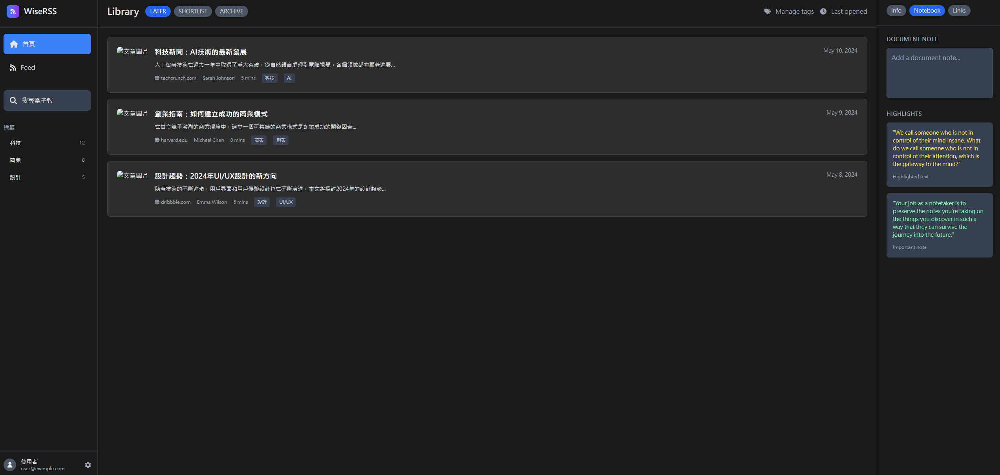
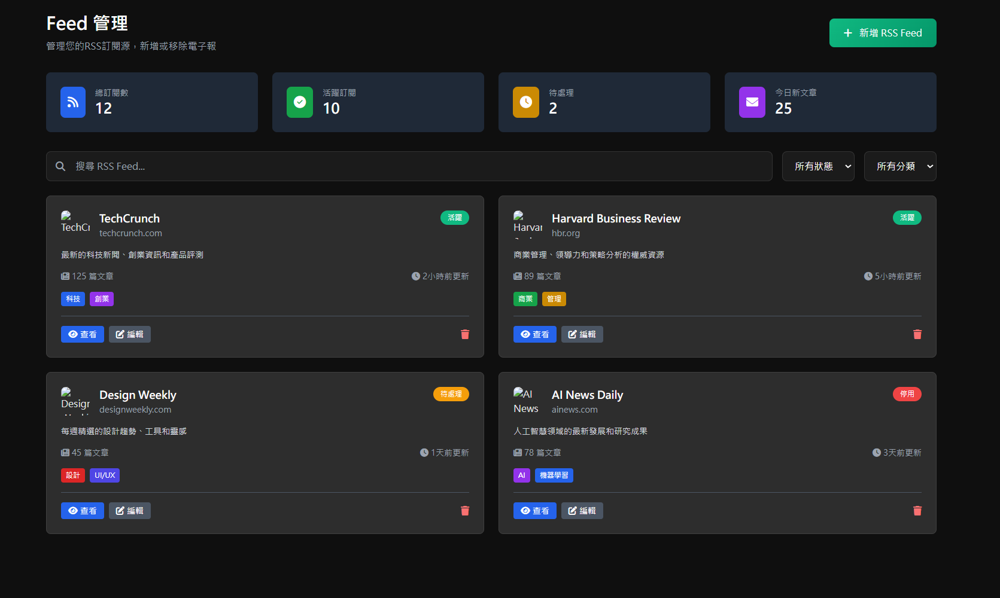
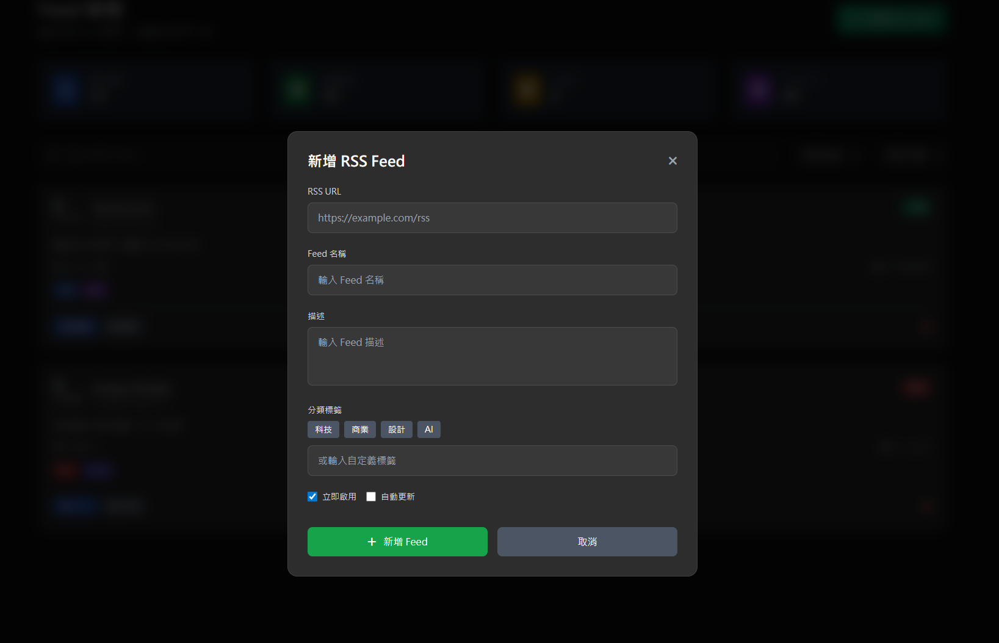
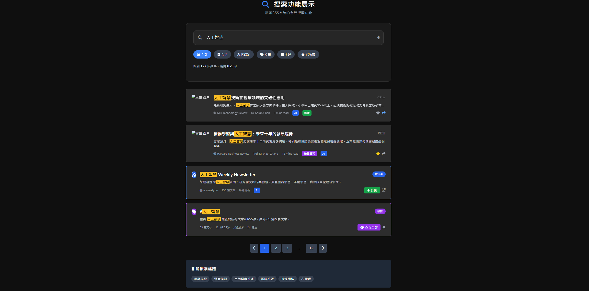

# WiseRSS - 智慧RSS閱讀系統 高保真原型

## 🎯 項目概述

WiseRSS 是一個現代化的Web RSS閱讀系統，提供完整的高保真原型設計，可直接用於開發。本原型完全基於您提供的參考圖片設計，採用深色主題和現代化UI元素。

## 🚀 核心功能

### 1. 用戶認證系統
- **登入頁面** (`login.html`)
  - 現代化的登入界面設計
  - 支援帳號密碼登入
  - 社交登入選項 (Google, GitHub)
  - 響應式設計，適配各種設備

### 2. 主要閱讀界面
- **首頁** (`home.html`)
  - 完全仿照參考圖片的三欄布局
  - 左側導航欄：首頁、Feed管理、搜尋功能
  - 中間內容區：文章列表展示
  - 右側面板：筆記和高亮功能
  - 即時搜尋Modal

### 3. RSS管理系統
- **Feed管理頁面** (`feed.html`)
  - RSS源的增刪改查功能
  - 統計儀表板
  - 分類和標籤管理
  - 批量操作功能

### 4. 搜尋功能
- **搜尋展示頁面** (`search-demo.html`)
  - 全局搜尋功能
  - 多類型結果展示（文章、RSS源、標籤）
  - 智能篩選和排序
  - 搜尋建議功能

## 🎨 設計特色

### UI/UX 設計原則
- **深色主題**：基於參考圖片的配色方案
- **現代化設計**：圓角、陰影、漸變效果
- **響應式布局**：適配桌面、平板、手機
- **無障礙設計**：符合WCAG標準

### 視覺元素
- **配色方案**：
  - 主背景：`#0f0f0f`
  - 次要背景：`#1a1a1a`
  - 卡片背景：`#2d2d2d`
  - 主要文字：`#e5e5e5`
  - 次要文字：`#a1a1aa`

- **圖標系統**：FontAwesome 6.4.0
- **字體**：系統字體堆疊，確保最佳顯示效果
- **動畫效果**：流暢的過渡和懸停效果

## 📁 文件結構

```
wiseRSS/
├── index.html              # 主入口頁面（原型展示）
├── login.html              # 登入頁面
├── home.html               # 首頁（主要閱讀界面）
├── feed.html               # Feed管理頁面
├── search-demo.html        # 搜尋功能展示
├── styles.css              # 全局樣式文件
└── README_PROTOTYPE.md     # 本說明文件
```

## 🛠️ 技術實現

### 前端技術棧
- **HTML5**：語義化標記
- **Tailwind CSS**：快速樣式開發
- **FontAwesome**：圖標系統
- **Vanilla JavaScript**：交互功能實現

### 特色功能實現
1. **模組化設計**：每個頁面獨立，便於維護
2. **iframe嵌入**：主頁面使用iframe展示各個原型
3. **響應式布局**：使用Flexbox和Grid
4. **交互動畫**：CSS3 transitions和transforms
5. **無障礙支援**：鍵盤導航、螢幕閱讀器友好

## 📱 頁面功能詳解

### 登入頁面 (login.html)
- ✅ 帳號密碼輸入驗證
- ✅ 密碼顯示/隱藏切換
- ✅ 記住我功能
- ✅ 社交登入按鈕
- ✅ 註冊連結
- ✅ 響應式設計

### 首頁 (home.html)
- ✅ 三欄布局設計
- ✅ 左側導航欄
  - 首頁/Feed切換
  - 搜尋按鈕
  - 標籤分類
  - 用戶資訊
- ✅ 中間文章列表
  - 文章卡片設計
  - 標籤和分類
  - 閱讀時間估算
- ✅ 右側筆記面板
  - 文檔筆記
  - 高亮內容
  - 相關連結
- ✅ 搜尋Modal功能

### Feed管理頁面 (feed.html)
- ✅ 統計儀表板
- ✅ RSS源管理
  - 新增RSS源
  - 編輯/刪除功能
  - 狀態管理
- ✅ 分類和標籤系統
- ✅ 搜尋和篩選功能

### 搜尋功能 (search-demo.html)
- ✅ 全局搜尋界面
- ✅ 多類型結果展示
- ✅ 智能篩選器
- ✅ 搜尋建議
- ✅ 分頁功能

## 🔧 使用說明

### 本地運行
1. 下載所有文件到本地目錄
2. 使用任何Web服務器打開 `index.html`
3. 或直接在瀏覽器中打開 `index.html`

### 開發建議
1. **樣式自定義**：修改 `styles.css` 中的CSS變量
2. **功能擴展**：在各個HTML文件中添加JavaScript邏輯
3. **後端整合**：將前端原型與後端API整合
4. **數據庫設計**：根據原型設計相應的數據結構

## 📧 電子報訂閱功能

系統提供完整的電子報訂閱功能：
- **RSS源管理**：用戶可以添加、編輯、刪除RSS訂閱
- **分類系統**：支援標籤和分類管理
- **搜尋功能**：可搜尋特定的電子報內容
- **通知系統**：新文章提醒功能

## 🎯 開發就緒特性

### 可直接用於開發的元素
1. **完整的HTML結構**：語義化標記，SEO友好
2. **CSS樣式系統**：模組化設計，易於維護
3. **JavaScript交互**：基礎功能實現，可擴展
4. **響應式設計**：適配各種設備尺寸
5. **無障礙支援**：符合Web標準

### 後續開發建議
1. **後端API整合**：
   - 用戶認證API
   - RSS源管理API
   - 文章內容API
   - 搜尋API

2. **數據庫設計**：
   - 用戶表
   - RSS源表
   - 文章表
   - 標籤表
   - 用戶偏好表

3. **功能增強**：
   - 離線閱讀
   - 文章同步
   - 社交分享
   - 個性化推薦

## 🌟 設計亮點

1. **忠實還原**：完全基於參考圖片設計
2. **現代化UI**：使用最新的設計趨勢
3. **用戶體驗**：流暢的交互和動畫
4. **可擴展性**：模組化設計，易於擴展
5. **開發友好**：清晰的代碼結構和註釋

## 📞 技術支援

如需技術支援或有任何問題，請參考：
- HTML/CSS最佳實踐
- JavaScript ES6+語法
- Tailwind CSS文檔
- FontAwesome圖標庫

---

# UI圖片

## login


## home


## feed


## add-feed


## search



---

**WiseRSS** - 打造個人的RSS閱讀系統 | 高保真原型設計 | 可直接用於開發